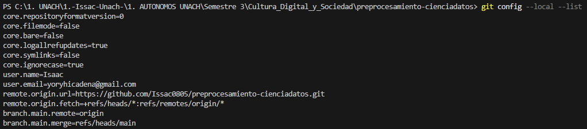
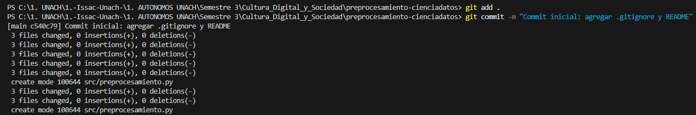
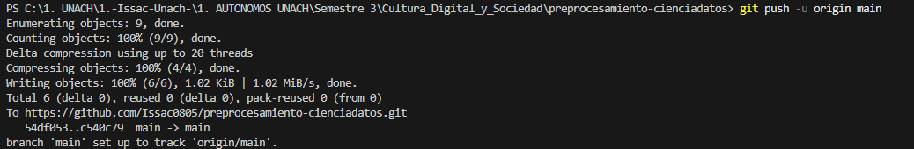
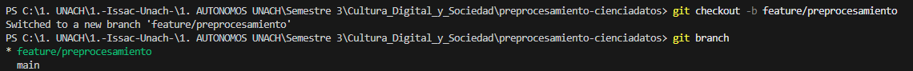
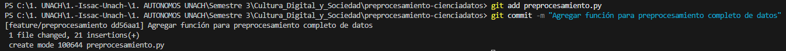
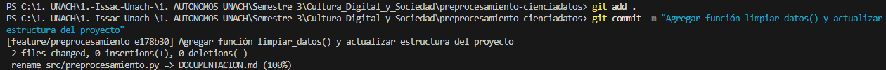
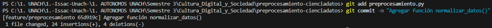
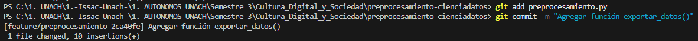

# DOCUMENTACIÓN DEL PROYECTO  
## Preprocesamiento de Datos - Cultura Digital y Sociedad  
### Nombre: Yoryhi Isaac Cadena Acosta  
### Unidad 2 - Tema 1  

---
## 1️. Descripción del proyecto
Este proyecto busca crear una serie de pasos simples para preparar datos antes de analizarlos, usando el lenguaje de programación Python y la herramienta llamada . Además, se usará Git y GitHub para guardar los cambios del proyecto de forma ordenada y segura.

---
## 2️. Estructura del repositorio
preprocesamiento-cienciadatos/

├── data/ 

├── docs/

│ . . .  └── evidencias/ 

│

├── .gitignore

├── DOCUMENTACION.md

├── preprocesamiento.py

└── README.md

---
## 3️. Funciones implementadas y comandos utilizados
### Funciones:
- `cargar_datos(ruta_archivo)` → Carga un dataset CSV.  
- `limpiar_datos(df)` → Elimina valores nulos y duplicados.  
- `normalizar_datos(df, columnas)` → Normaliza columnas numéricas entre 0 y 1.  
- `exportar_datos(df, ruta_salida)` → Exporta los datos procesados a un nuevo CSV.

### Comandos:
| Comando | ¿Qué hace? |
|---------|-----------|
|git config --global user.name "Tu Nombre" |Guarda nuestro nombre o el que pusimos en Git|
|git config --global user.email "yoryhicadena@gmail.com"| Guarda el correo asociado al repositorio|
|git init |Inicia un nuevo repositorio de Git en la carpeta|
|git clone URL |Descarga o clona un repositorio de GitHub al computador|
|git status |Muestra que archivos han cambiado o estan listos para subir|
|git add . |Prepara todos los archivos nuevos o modificados para el commit|
|git commit -m "mensaje" |Guarda una versión "commit" del proyecto con un mensaje|
|git branch |Muestra todas las ramas existentes|
|git checkout -b nombre-rama |Crea y cambia a una nueva rama|
|git merge nombre-rama |Une los cambios de otra rama con la rama principal que es main|
|git push origin main |Sube los cambios de la rama principal al repositorio de GitHub|
|git pull |Descarga los últimos cambios desde GitHub|

---
## 4️. Proceso de trabajo con Git y GitHub
1. Crear el proyecto en GitHub y hacer la configuración inicial, con los archivos importantes: (`.gitignore` y `README.md`)
2. Se crea la rama `feature/preprocesamiento`, donde se escribira el código para preparar los datos
3. Se agregan funciones poco a poco y se guarda cada cambio con una nota que explique qué se hiz es decir “commit”
4. Unir el nuevo trabajo "merge" de la rama `feature/preprocesamiento` en `main` 
5. Enviar todos los cambios al proyecto en GitHub, para que queden guardados

---
## 5️. Evidencias del proceso
1. Configuración del nombre y correo en Git 
2. Creación del repositorio y archivos iniciales (.gitignore, README.md) 
3. Commit inicial y push a GitHub  
4. Creación de la rama feature/preprocesamiento 
5. Commit con función preprocesamiento completo de datos 
6. Commit con función limpiar_datos() 
7. Commit con función normalizar_datos() 
8. Commit con función exportar_datos() 
9. Fusión y push final hacia main | 

---
## 6️. Enlace al repositorio en GitHub
[https://github.com/Issac0805/preprocesamiento-cienciadatos](https://github.com/Issac0805/preprocesamiento-cienciadatos)

---
## 7️. Conclusión
Este royecto arefor el uso de **Git y GitHub** como herramientas de colaboración y control de versiones, así como aplicar **técnicas básicas de preprocesamiento de datos**.  
Durante el desarrollo se realizó un flujo completo: creación de ramas, commits, merge y documentación de evidencias.

Este proyecto ayudó a practicar cómo trabajar en equipo y guardar los cambios del código de forma ordenada usando Git y GitHub. También sirvió para aplicar pasos básicos para preparar los datos antes de analizarlos.
Durante el trabajo se siguió todo el proceso: se crearon líneas de trabajo (ramas), se guardaron cambios con notas (commits), se unieron los avances (merge), y se dejó constancia de todo lo hecho con documentación.